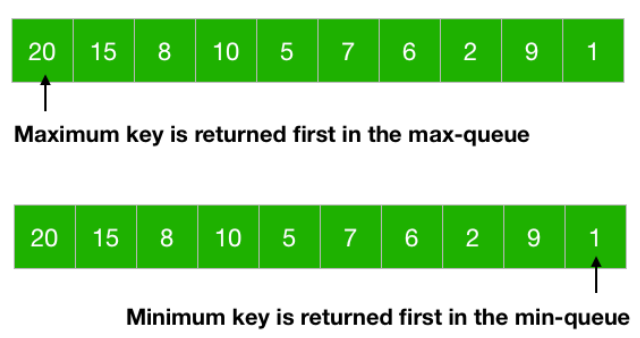
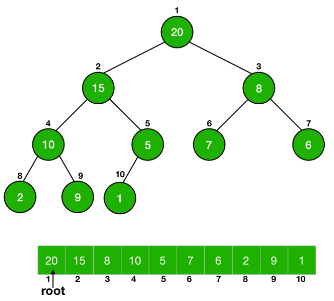
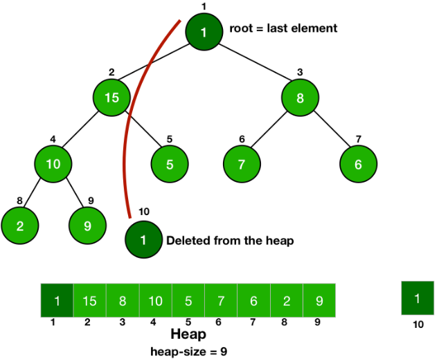

# Heap

## 概念

* 中文又稱作堆積。
* 近似於完全二元樹的資料結構。
* 子節點會帶有一個鍵值(key)，總是會小於/大於父節點。
* 通常使用陣列來實現。
* 常被用於實現優先隊列 (Priority Queue)。
* 使用陣列來保存二元樹，能同時最佳地利用空間和時間，最壞情況下也能保證 O(2logN)。
* 有最大堆積和最小堆積，最大堆積的索引0保存最大元素；最小堆積則是保存最小元素。



## 特性

* 每個節點的左右子樹，也會是一個二元樹。
* 在索引從0開始的陣列中。
    * 節點 `i` 的左子節點在 `2 * index + 1`
    * 節點 `i` 的右子節點在 `2 * index + 2`
    * 節點 `i` 的父子節點在 `Math.floor((i - 1) * 2)`

把上一張圖的陣列轉化為二元樹，就可以看出是如何用陣列來保存這種樹狀結構的。




以最大堆積為例，下面的流程圖解會更清楚說明是怎麼用陣列來保存這種二元樹的結構


## 操作

堆主要有兩個操作，新增一個節點和取出一個節點，但當我們從堆積中取出或插入元素時，可能會破壞堆積的特性，為了保持堆的特性不被破壞，當我們更新了堆積後還會需要對堆積進行修補。

### 向上修補

這個修補的行為也稱為 `heapifyUp`。

1. 向堆積插入一個元素
2. 從此元素開始進行修補
3. 計算此元素父節點的索引，並取得父節點的值
4. 比較父節點是否大於/小於此節點，如果條件成立就交換兩個元素
5. 不斷地重複以上步驟往上比對，直到父節點的索引小於0為止

其中2~5的過程通常會以遞迴的方式進行。

### 向下修補

這個修補的行為也稱為 `heapifyDown`。

1. 從堆積取出最大或最小的元素（其實就是頂部元素，看是最大或最小堆積而性質不同）
2. 從堆積取出最後一個元素(二元樹的最後一個節點)，並替換到索引0的位置（也就是根節點root）
3. 從根節點開始進行修補
4. 從當前節點開始計算左子節點和右子節點的索引
5. 找出當前節點、左子節點和右子節點中具有最小或最大值的節點
6. 如果當前節點不是最小值的節點，則將當前節點與最小值節點進行交換
7. 不斷地重複以上步驟向下比對，直到沒有子節點為止

其中4~7的過程通常會以遞迴的方式進行。



## 實現

這裡以 JavaScript 來實現一個最小堆積，最大堆積也是一樣的概念，稍微調整下 `heapifyUp` 和 `heapifyDown` 的邏輯和幾個函式的命名即可。

### Min Heap

```javascript
class MinHeap {
    constructor() {
        this.heap = []
    }

    top() {
        return this.heap[0]
    }

    // 返回堆的大小
    size() {
        return this.heap.length
    }

    // 空判斷
    isEmpty() {
        return this.size() === 0
    }

    // 添加一個元素
    insert(value) {
        this.heap.push(value)
        this.heapifyUp(this.size() - 1)
    }

    // 取出最小值並移除
    extractMin() {
        if (this.isEmpty()) {
            return null
        }

        const minValue = this.heap[0]
        const last = this.heap.pop()

        if (!this.isEmpty()) {
            this.heap[0] = last
            this.heapifyDown(0)
        }

        return minValue
    }

    /**
     *  向上修復堆
        用途：當我們向堆中插入一個新元素時，新元素可能破壞堆的性質。為了維護堆性質，我們需要通過將該元素向上移動的方式來修復堆。
        邏輯：
        1. 計算父節點的索引，即 `Math.floor((index - 1) / 2)`。
        2. 如果父節點索引小於0，說明已經到達堆頂，結束修復過程。
        3. 如果新元素值小於父節點的值，就交換新元素和父節點的位置。
        4. 重複以上步驟，直到新元素到達堆頂或滿足堆的性質。
     */
    heapifyUp(index) {
        const parentIndex = Math.floor((index - 1) / 2)
        if (parentIndex < 0) {
            return
        }

        if (this.heap[parentIndex] > this.heap[index]) {
            ;[this.heap[parentIndex], this.heap[index]] = [this.heap[index], this.heap[parentIndex]]
            this.heapifyUp(parentIndex)
        }
    }

    /**
     *  向下修復堆
        用途：當我們從堆中移除最小的元素（最小堆的頂部元素）時，移除操作很可能破壞堆的性質。為了維護堆性質，我們需要通過將新的頂部元素（一般為最後一個玩家）向下移動的方式來修復堆。
        邏輯：
        1. 計算左子節點和右子節點的索引，即 `2 * index + 1` 和 `2 * index + 2`。
        2. 尋找當前節點、左子節點和右子節點中具有最小值的節點。
        3. 如果當前節點不是具有最小值的節點，則將當前節點的值與具有最小值的子節點進行交換。
        4. 重複以上步驟，直到當前節點成功移到其正確的位置上或達到堆的底部。
     */
    heapifyDown(index) {
        const leftChildIndex = 2 * index + 1
        const rightChildIndex = 2 * index + 2

        let smallest = index

        if (leftChildIndex < this.size() && this.heap[leftChildIndex] < this.heap[smallest]) {
            smallest = leftChildIndex
        }

        if (rightChildIndex < this.size() && this.heap[rightChildIndex] < this.heap[smallest]) {
            smallest = rightChildIndex
        }

        if (smallest !== index) {
            ;[this.heap[smallest], this.heap[index]] = [this.heap[index], this.heap[smallest]]
            this.heapifyDown(smallest)
        }
    }
}
```

## LeetCode 練習

[703. Kth Largest Element in a Stream
](https://leetcode.com/problems/kth-largest-element-in-a-stream)
[215. Kth Largest Element in an Array
](https://leetcode.com/problems/kth-largest-element-in-an-array/)

## 參考

* https://www.codesdope.com/blog/article/priority-queue-using-heap/
* https://www.codesdope.com/course/data-structures-priority-queues/